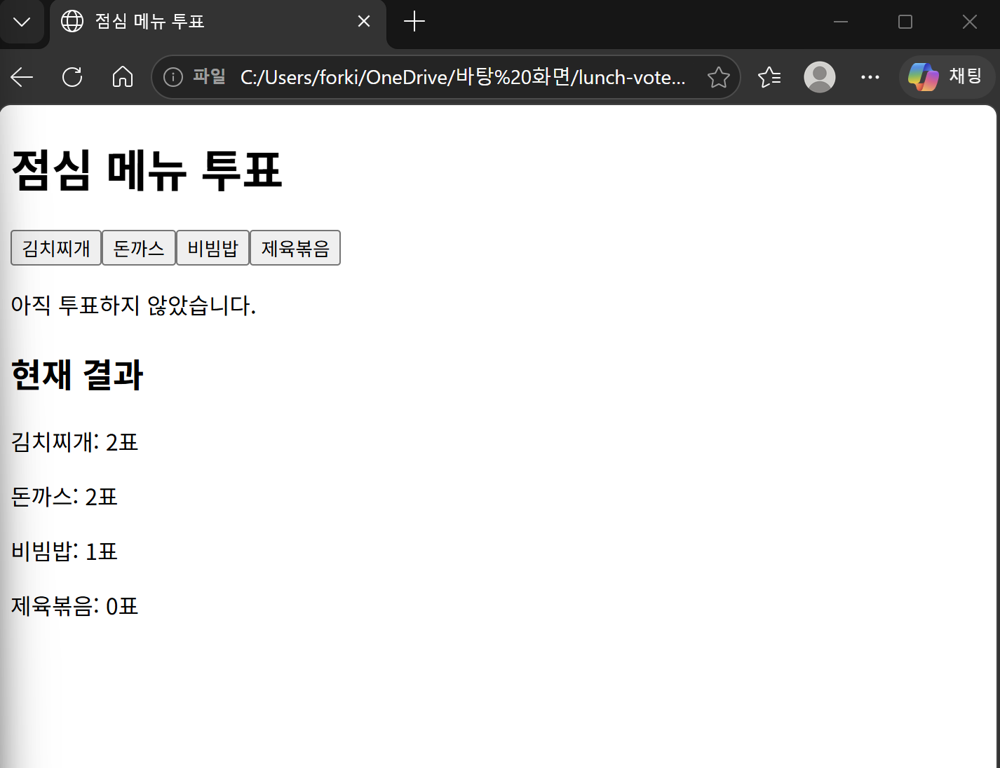
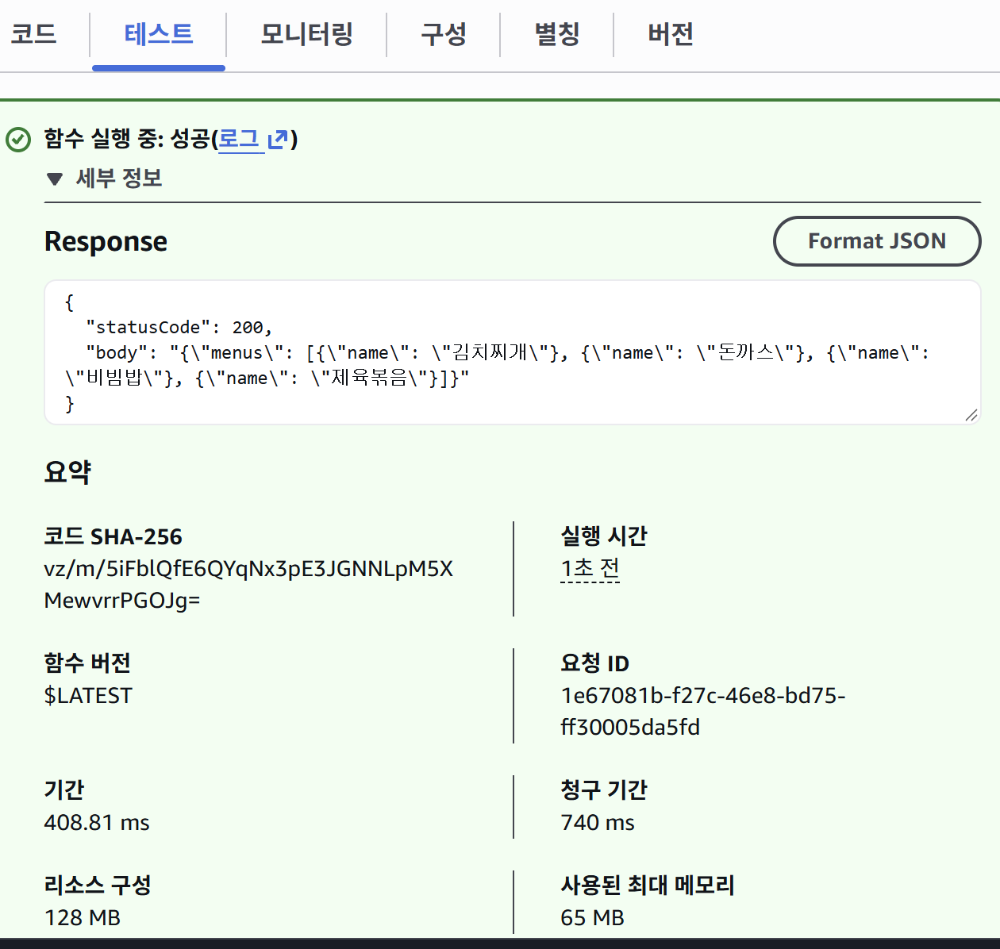
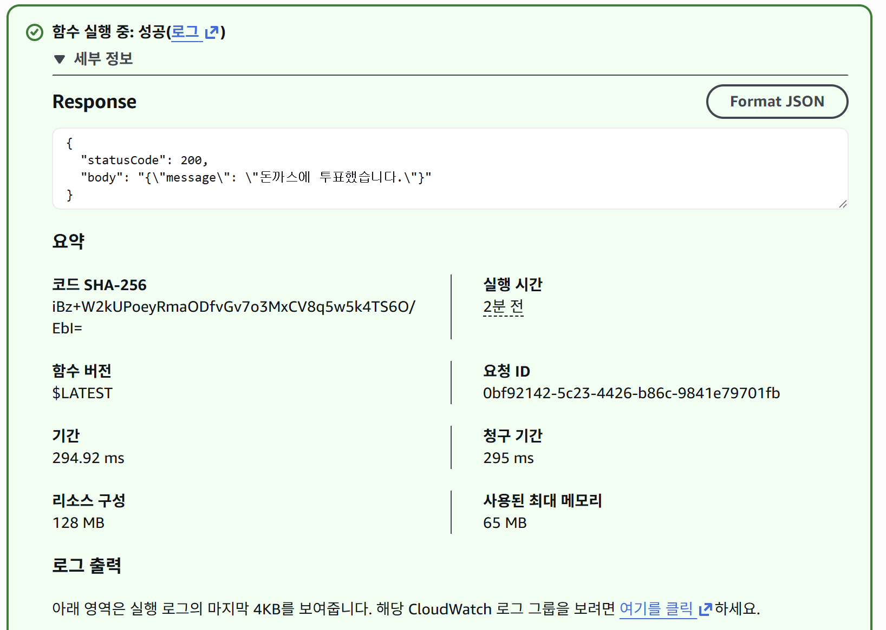
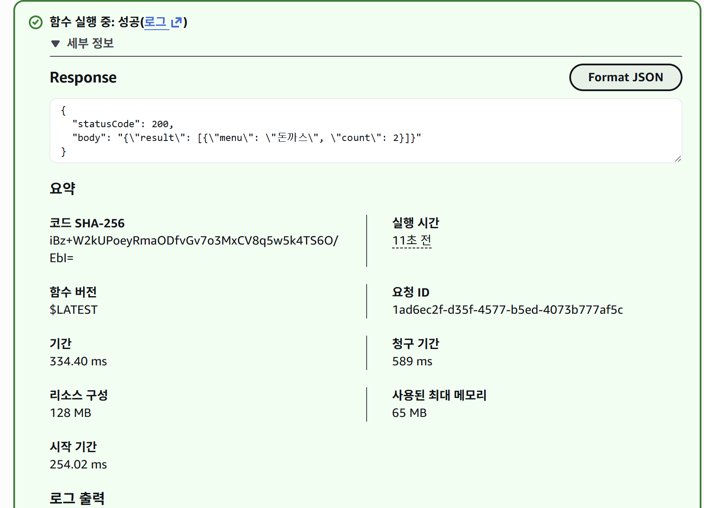
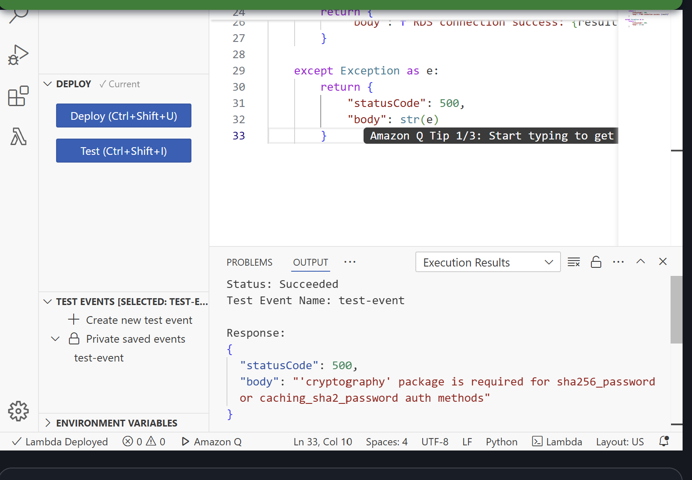
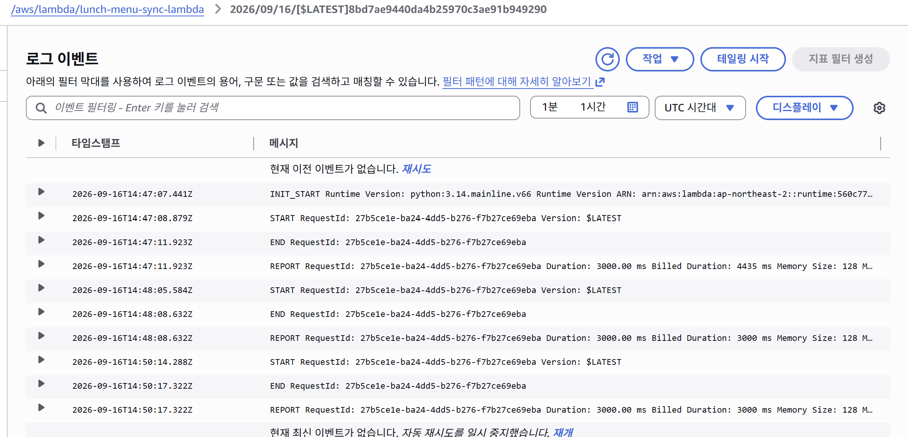
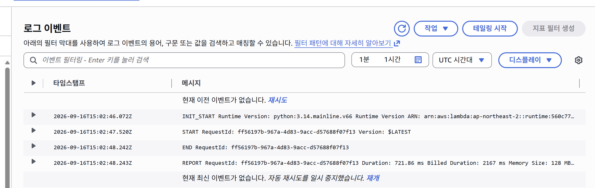

# AWS Serverless Lunch Vote

AWS의 Lambda, RDS, S3를 활용해 구현한 점심 메뉴 투표 서비스입니다.

클라우드컴퓨팅 수업에서 완성하지 못했던 Lambda-RDS 연동 과제를 바탕으로 개인 프로젝트를 다시 진행했습니다.  
투표 데이터 저장·조회부터 S3 정적 웹 배포, CSV 업로드 기반 메뉴 자동 동기화까지 확장하여 구현했습니다.

> 프로젝트 완료 후 비용 발생을 방지하기 위해 AWS 리소스는 정리했으며, 구현 결과는 코드와 실행 화면으로 기록했습니다.

---

## Architecture

```text
사용자
  │
  ▼
S3 Static Website
  │
  │ HTTP Request
  ▼
Lambda Function URL
  │
  ▼
lunch-vote-lambda
  │
  ▼
RDS MySQL
  ├─ votes
  └─ menus


menus.csv 업로드
  │
  ▼
Amazon S3
  │ ObjectCreated Event
  ▼
lunch-menu-sync-lambda
  │
  ▼
RDS menus table
```

### 네트워크 구성

```text
Lambda
  │
  ├─ VPC 내부에서 RDS 접근
  │      └─ Security Group으로 MySQL 3306 허용
  │
  └─ S3 Gateway VPC Endpoint
         └─ VPC 내부 Lambda에서 S3 접근
```

---

## 주요 기능

- DB에서 메뉴 목록을 조회하여 웹 버튼을 동적으로 생성
- 메뉴 선택 시 Lambda를 통해 RDS에 투표 데이터 저장
- 메뉴별 투표 수 집계 및 조회
- Amazon S3 정적 웹사이트 호스팅
- `menus.csv` 업로드 시 S3 이벤트로 Lambda 자동 실행
- CSV의 메뉴 목록을 RDS `menus` 테이블에 자동 반영

---

## Tech Stack

### AWS
- AWS Lambda
- Amazon RDS for MySQL
- Amazon S3
- Amazon VPC
- Security Group
- VPC Endpoint
- IAM
- Amazon CloudWatch Logs

### Development
- Python
- PyMySQL
- HTML
- JavaScript
- SQL

---

## 구현 결과

### 1. DB 기반 동적 메뉴 생성

기존에 HTML에 직접 작성하던 메뉴 버튼을 DB에서 조회하도록 변경했습니다.  
`/menus` API 응답을 기반으로 웹에서 메뉴 버튼을 동적으로 생성합니다.



### 2. 최종 서비스 동작

동적으로 생성된 메뉴를 선택하면 투표가 저장되고 결과에 즉시 반영됩니다.



### 3. 투표 저장 API

`POST /vote` 요청으로 선택한 메뉴를 RDS의 `votes` 테이블에 저장했습니다.



### 4. 투표 결과 조회 API

`GET /summary` 요청으로 메뉴별 투표 수를 집계하여 반환했습니다.



---

## S3 기반 메뉴 자동 동기화

웹의 메뉴 구성을 변경할 때 Lambda 코드를 직접 수정하지 않고,  
S3에 업로드한 `menus.csv`를 기준으로 DB 메뉴 목록을 갱신하도록 구성했습니다.

동작 흐름은 다음과 같습니다.

```text
menus.csv 업로드
        ↓
S3 ObjectCreated Event
        ↓
lunch-menu-sync-lambda 실행
        ↓
CSV 파일 읽기
        ↓
RDS menus 테이블 갱신
        ↓
/menus API를 통해 웹에 반영
```

메뉴 4개가 RDS에 반영된 후 `/menus` API에서 정상 조회되는 것을 확인했습니다.


---

## Troubleshooting

### 1. MySQL 인증 과정의 `cryptography` 의존성 문제

Lambda에서 PyMySQL을 이용해 RDS MySQL에 연결하는 과정에서 다음 오류가 발생했습니다.

```text
'cryptography' package is required for sha256_password
or caching_sha2_password auth methods
```



처음에는 PyMySQL만 포함한 Lambda Layer를 사용했지만, MySQL 인증 방식에서 추가 의존성이 필요했습니다.

AWS CloudShell에서 Lambda 실행 환경에 맞게 `PyMySQL`과 `cryptography`를 함께 포함한 Layer를 다시 구성하여 문제를 해결했습니다.

이를 통해 애플리케이션 코드뿐 아니라 실행 환경의 의존성도 함께 확인해야 한다는 점을 경험했습니다.

---

### 2. VPC 내부 Lambda의 S3 접근 타임아웃

메뉴 동기화 Lambda를 RDS와 연결하기 위해 VPC에 배치한 후, S3 객체를 읽는 과정에서 실행이 반복적으로 3초 타임아웃되는 문제가 발생했습니다.

CloudWatch 로그에서 실행이 매번 약 `3000 ms`에 종료되는 것을 확인했습니다.



Lambda가 VPC 내부에 있으면서 S3로 접근할 네트워크 경로가 없는 문제로 판단하고,  
해당 VPC에 **S3 Gateway VPC Endpoint**를 추가했습니다.

Endpoint 적용 후 Lambda가 약 `722 ms`에 정상 종료되는 것을 확인했습니다.



이후 S3의 `menus.csv`를 정상적으로 읽어 RDS에 반영할 수 있었습니다.

---

## Database

프로젝트에서는 두 개의 테이블을 사용했습니다.

### votes

| Column | Description |
|---|---|
| id | 투표 ID |
| menu | 선택한 메뉴 |
| created_at | 투표 생성 시각 |

### menus

| Column | Description |
|---|---|
| id | 메뉴 ID |
| name | 메뉴 이름 |

테이블 생성 SQL은 [`schema.sql`](schema.sql)에서 확인할 수 있습니다.

---

## Repository Structure

```text
aws-serverless-lunch-vote/
│
├─ index.html
├─ lambda_vote.py
├─ lambda_menu_sync.py
├─ menus.csv
├─ schema.sql
│
└─ images/
   ├─ 01_dynamic_menu.png
   ├─ 02_final_service.png
   ├─ 03_vote_success.png
   ├─ 04_summary_success.png
   ├─ 05_cryptography_error.png
   ├─ 06_s3_timeout.png
   ├─ 07_vpc_endpoint_resolved.png
   └─ 08_menu_sync_success.png
```

---

## 주요 AWS 설정

### Lambda
- Runtime: Python 3.14
- Architecture: x86_64
- VPC 연결
- Function URL을 통한 웹 요청 처리

### RDS
- MySQL
- Lambda와 동일 VPC에서 연결
- Security Group을 통해 Lambda에서 MySQL 3306 포트 접근 허용

### S3
- 정적 웹사이트 호스팅
- `menus.csv` 업로드 이벤트를 Lambda Trigger로 연결

### VPC Endpoint
- S3 Gateway VPC Endpoint 사용
- VPC 내부 Lambda가 인터넷 경로 없이 S3에 접근하도록 구성

---

## 구현하면서 확인한 점

Lambda-RDS 연결 과정에서는 코드 외에도 VPC, Security Group, IAM 권한, Python 의존성이 함께 맞아야 했습니다.

또한 S3 접근 타임아웃 문제는 CloudWatch 로그를 통해 확인했고, S3 Gateway VPC Endpoint를 추가해 해결했습니다.

---

# 추가로 개선할 수 있는 부분

현재 프로젝트는 기능 구현과 AWS 서비스 간 연결 구조 확인에 초점을 맞춘 개발용 구성입니다.

실제 운영 환경을 고려한다면 DB 인증정보를 Secrets Manager로 관리하고, RDS를 Private Subnet에 배치하며, HTTPS 및 API 접근 제어를 추가하는 방식으로 보완할 수 있습니다.
